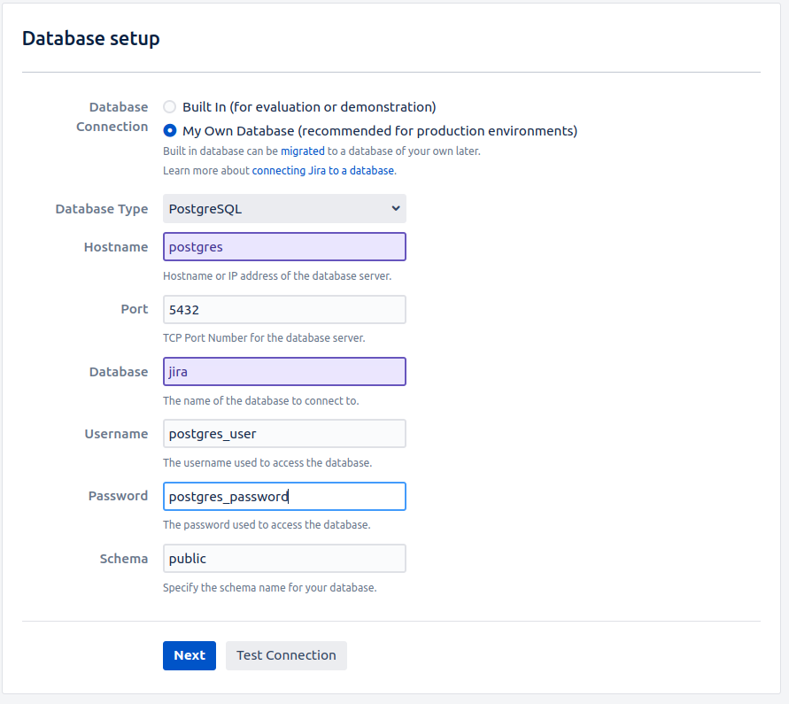
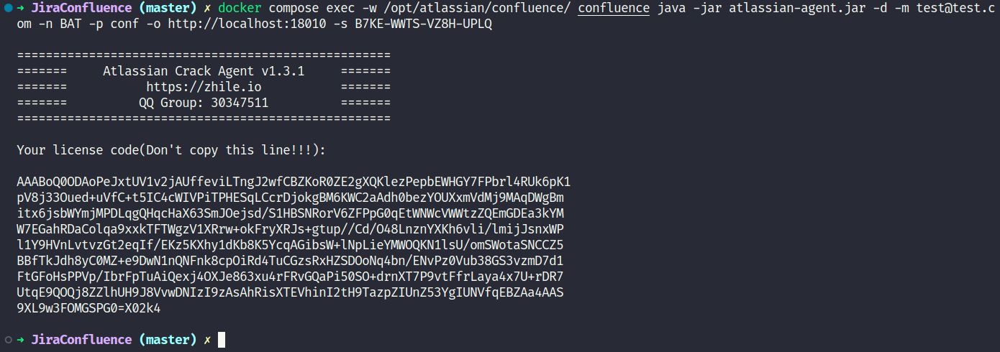

# Jira Confluence

## Usage

### Docker build & up

- `docker compose build`
- `docker compose up -d`

### Jira

- Visit jira: [localhost:18009/](http://localhost:18009/), select language and choose manual configuration
    

        
    

- Configure stand-alone databases
    

        
    

- Set up application properties
    

        
    

- Cracking
  - Copy `Server ID` from web

  - `docker compose exec -w /opt/atlassian/jira/ jira java -jar atlassian-agent.jar -d -m test@test.com -n BAT -p jira -o http://<IP>:18009 -s <Server ID>`

    

        
    

    

        
    

- Configure stand-alone databases
    

        
    

- Setup admin account
    

        
    

### Confluence

- Visit jira: [localhost:18010](http://localhost:18010), pick an app
    

        
    

- Cracking
  - Copy `Server ID` from web

  - `docker compose exec -w /opt/atlassian/confluence/ confluence java -jar atlassian-agent.jar -d -m test@test.com -n BAT -p conf -o http://<IP>:18010 -s <COPY FROM WEB>`

    

        
    

    

        
    

## TODO

- Bitbucket
- Prefix

## Acknowledgments

- [gitee.com/pengzhile/atlassian-agent](https://gitee.com/pengzhile/atlassian-agent)
- [programmer.group/docker-installs-jira-and-confluence-cracked-version.html](https://programmer.group/docker-installs-jira-and-confluence-cracked-version.html)
